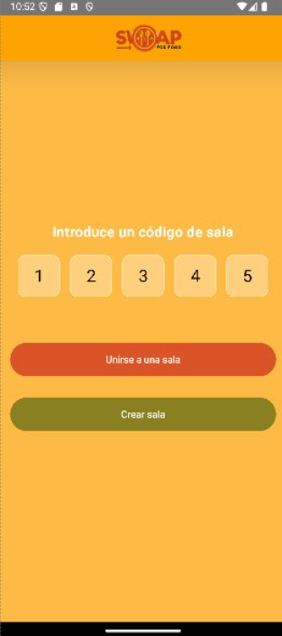
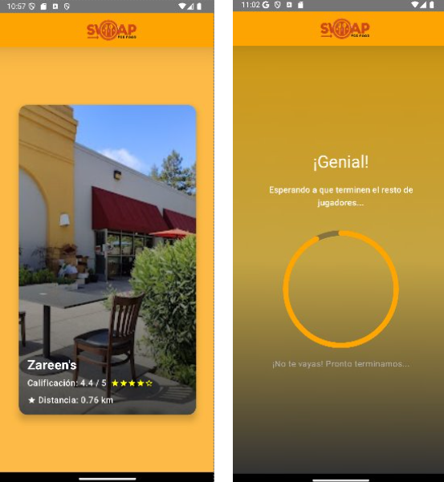
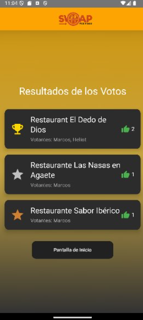

# SwapForFood
<h1 align="center">🌟 Aplicación final de curso </h1>

Se ha realizado una aplicación que se basa en la decisión, por un grupo de amigos, de un restaurante para ir a comer, cercano a ellos. 

*Trabajo realizado por*:
- [](https://github.com/kratoscordoba7)
- [](https://github.com/DerKom)


## 🛠️ Librerías Utilizadas


---

## 🚀 Cómo ejecutar el proyecto

Sigue estos pasos para configurar y ejecutar la aplicación en tu entorno local:
# Servidor
1. Clona este repositorio:
   ```bash
   git clone https://github.com/DerKom/SwapForFood-server
   ```
2. Asegura tener todas las librerías (fastapi, uvicorn, request)
3. En la terminal de su IDE, abrir el proyecto clonado y ejecutar con el comando
   ```bash
   python main.py
   ```
# Cliente
1. Clona este repositorio:
   ```bash
   git clone https://github.com/kratoscordoba7/SwapForFood.git
   ```
2. Abre el proyecto en Android Studio.
3. Asegúrate de que tienes un emulador configurado o un dispositivo físico conectado.
4. En el fichero connectionManager la ip debe ser tu servidor local 10.0.2.2:8080
5. Ejecuta el proyecto presionando el botón **Run**.

---

### Objetivos 📖
La apliación está diseñada bajo el siguiente concepto:
Imagínese que ha quedado con un grupo de amigos para ver un película o cualquier evento social. Durante el desarrollo de dicho evento en el espectro común surge la idea de comer algo pero no se consigue consensuar algo fácilmente, en este contexto entra nuestra apliación, SwapForFood. Mediante la aplicación se podrá elegir mayoritariamente qué restaurante es el más aceptado en la zona y al cuál se irá. La aplicación opta por un diseño ágil, rápido y divertido para evitar la larga discusión que puede tomar llegar a un punto común entre un grupo de personas.

### Distribución 🎨
Este apartado se puede definir en dos subapartados. Por un lado se tiene la distribución de los paquetes y por otro la experiencia de usuario (UX):
- Paquetes:
  - Server:
    - Archivo connectionManager: Maneja la vida de la conexión, el envío, recibimiento y clasificación de mesajes con el servidor.
    - Archivo client: Aporta utilidades usadas por el connectionManager (crear conexión, eliminar conexión, recibir mensajes).
  - UI:
    - Paquete Screens: Se definen todas las pantallas de la aplicación. Estas pantallas observa el cambio en los StateFlow del connectionManager para cambiar la vista a tiempo real.
    - Paquete Componets: Se definen segmentos de código usado por las vistas (Screens) para manejar mejor la responsabilidad única y la modularidad del código.
  - Utils:
    - Se definen archivos que aportan utilidades usadas tanto en las vistas como en el manejo de la conexión con el servidor:
      - Conseguir la ip del dispositivo.
      - Conseguir la ubicación del dispositivo.
      - Mostrar diálogos informativos o que piden input (Desconexiones de la sala, introducción del username al unirte a la sala).
  - DataStructures:
    - Message: Convenio de información para la comunicación con el servidor.
    - Restaurant: Modelo que es usado para el juego, usado en la vista startGameScreen     
- UX:
   - La aplicación opta por la agilidad. Por tanto, no posee login, para que la experiencia, entre usuarios que desconocen la app y aquellos que ya la tenían descargada, sea fluida.
   - Además, la privacidad de los usuarios es primordial. En ningún momento se almacena ningún dato, ni la ubicación en el momento específico ni los gustos de los restaurantes de los mismos.

### Diseño 🎨
<div align="center">
   
</div>

En esta pantalla, el usuario puede unirse a una sala existente o crear una nueva. Cabe destacar que la opción de unirse no aparece si no se ingresan exactamente 5 dígitos en el campo de texto.

- Durante el proceso de unión, se envía al servidor el nombre de usuario (username) y el código de la sala a la que el usuario desea unirse. Si la sala existe, el servidor devuelve el conjunto de usuarios que están actualmente en esa sala.
- Durante el proceso de creación de la sala el usuario introduce y envía al servidor el nombre de usuario que tendrá en esa sala. El servidor devuelve el código que se generó aleatoriamente y asigna a el usuario creador el rol de lider.


<div align="center">
   
</div>

En esta pantalla hay dos posbilidades ser lider o no serlo:

- Si no eres lider quedas a la espera teniendo la posibilidad de volver a la sala de inicio.
- Si eres lider puedes eliminar a cualquier usuario de la sala, el usuario eliminado será notificado mediante un diálogo. Además, puede iniciar el juego, en este momento se le manda al servidor la ubicación del lider y se devuelve a todos los participantes de la sala el conjunto de restaurantes cercanos.
  
<div align="center" height=300>
   
</div>

En estas imágenes se muestra una preview del juego, una carta informativa del restaurante que si es desplazada a la derecha se toma como voto positivo y si se desplaza a la izquierda se toma como voto negativo. Por otro lado, si un usuario vota todos los restaurantes antes de que todos los usuarios hayan votado se le mostrará una pantalla de espera (pantalla de la derecha).

<div align="center">
   
</div>
En esta pantalla, se muestran los tres restaurantes más votados y quiénes los votaron. Así mismo, se permite al usuario volver a la pantalla de inicio.

### Arquitectura 🏢
La arquitectura usada en la aplicación es MVVM, la única mayormente aceptada por la comunidad de devs de Kotlin, aquí se explica su uso:
- Los modelos (Restaurant) son usados en las vistas. (M)
- Las vistas observan los StateFlow del ViewModel. (V)
- El ViewModel, que es el connectionManager, obtiene información del servidor y cambia ciertos StateFlow, usando los modelos de Restaurant y Message. (VM)

### Funcionalidades 📱
 Los usuarios pueden:
  - "Jugar" para decidir de manera mayoritaria qué restaurante es el deseado por el grupo de participantes.
  - Para ello, y como paso intermedio, los usuarios pueden crear y unirse a salas que darán comienzo al juego.

Los usuarios obtienen:
   - Una decisión mayoritaria y rápida, sin discutir durante un rato entre sus amigos.
   - Privacidad en el proceso

### Librerías utilizadas 💻
- Jetpack Compose -> UI.
- Ktor -> Conexión mediante websockets.
- Google APIs -> Usado en el servidor, para obtener restaurantes.

### Principios y buenas prácticas ❗

- Single Responsability
El código provoca que cada fichero y cada función tenga una única responsabilidad así como respetar el principio de abierto/cerrado, véase el siguiente ejemplo:

```kotlin
    private fun handleServerMessage(message: String) {
        try {
            val jsonObject = JSONObject(message) // Parsear el mensaje JSON
            val messageContent = jsonObject.getString("message") // Extraer el campo "message"

            when {
                // CREAR LA SALA
                messageContent.startsWith("0000") -> {
                    creatingTheLobbyAsLeader(messageContent)
                }
                // UNIRSE A LA SALA y recibir lista de usuarios
                messageContent.startsWith("0001") -> {
                    joiningToTheLobby(messageContent)
                }

                // Notificación de nuevo usuario
                messageContent.startsWith("USER_JOINED.") -> {
                    notifyingExistingUsers(messageContent)
                }

                // Notificación de usuario que salió
                messageContent.startsWith("USER_LEFT.") -> {
                    notifyingSomeoneLeft(messageContent)
                }

                // El lider dejó la sala
                messageContent.contains("ROOM_CLOSED") ||
                        messageContent.contains("REMOVED") -> {
                    Log.d("LobbyViewModel", "La sala ha sido cerrada.")
                    viewModelScope.launch {
                        _roomStatus.value = "CLOSED"
                    }
                }

                // Mensaje de error del servidor
                messageContent.startsWith("Error:") -> {
                    _connectionState.value = "Server Error: $messageContent"
                    Log.w("LobbyViewModel", "Error del servidor: $messageContent")
                }

                // Otros mensajes
                else -> {
                    Log.d("LobbyViewModel", "Mensaje no reconocido: $messageContent")
                }
            }
        } catch (e: Exception) {
            Log.e("LobbyViewModel", "Error al parsear el mensaje: ${e.message}")
        }
    }
```
El segmento de código superior tiene como funcionalidad detectar qué mensaje es el entrante, en la función initialize se recibe el mensaje, se manda aquí y se clasifica. La función es completa y deriva a funciones externas que satisfacen el tratamiento del mensaje, responsabilidad que NO es de la función superior, respetando así el principio de responsabilidad única. Por otro lado, está preparada para añadir más mensajes sin alterar el flujo actual, respetando el principio abierto/cerrado.
- Don't repeat yourself, corutinas y dispatches
```kotlin
    private fun initialize() {
        if (isInitialized) return
        isInitialized = true

        // Lógica inicial del ViewModel
        viewModelScope.launch(Dispatchers.IO) {
            try {
                if (webSocketClient.session == null || !webSocketClient.session!!.isActive) {
                    webSocketClient.connect()
                    _connectionState.value = "Connected"
                }

                // Escuchar mensajes del servidor
                webSocketClient.incomingMessages.collect { message ->
                    handleServerMessage(message)
                }
            } catch (e: Exception) {
                Log.e("LobbyViewModel", "Error al conectarse al WebSocket: ${e.message}")
                _connectionState.value = "Error: ${e.message}"
            }
        }
    }
```
La función initialize es importante y se repetía este código en la app. Por lo tanto, se encapsuló en una función y en cada lugar de repetir código se llama a la función.  viewModelScope.launch implica que las tareas se cancelen automáticamente cuando el ViewModel se destruye y Dispatchers.IO asegura operaciones de red y procesamiento fuera del hilo principal para evitar bloqueos.

---

## 📚 Bibliografía

1. [Jetpack Compose](https://developer.android.com/compose)
2. [Ktor](https://ktor.io)
3. [Google APIs](https://cloud.google.com/apis)
4. [Kotlin](https://kotlinlang.org)
5. [FastAPI](https://fastapi.tiangolo.com)
6. [Uvicorn](https://www.uvicorn.org)

---

**Universidad de Las Palmas de Gran Canaria**  

EII - Grado de Ingeniería Informática

---
